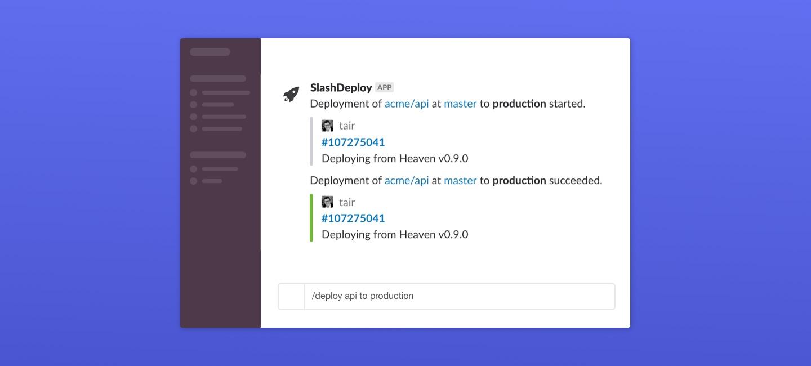

# SlashDeploy Roadmap

## Overview

[SlashDeploy](https://getslashdeploy.com/?utm_source=github&utm_medium=roadmap) helps your team manage deployments without leaving Slack. It's powered by [GitHub](https://developer.github.com/v3/repos/deployments) and additionally brings you these awesome features:

- **Simple deployments** - Enable anybody in your team to deploy faster without leaving Slack.
- **Continuous deployment** - List the auto-deploy branches to automatically deploy changes.
- **Commit status checks** - Ensure broken deployments never reach your users.
- **Environment locks** - Prevent others from accidentally deploying to a shared environment.
- **Plain text configuration** - Manage your deployment configuration alongside your code.
- **Backed by GitHub Deployment API** - Gain full control over your data and infrastructure.

This repo is our [public roadmap](https://github.com/getslashdeploy/roadmap/projects/1) where you can request features, report bugs or send any feedback you wish 🤗

## Contribute

Just skim over our [current issues](https://github.com/getslashdeploy/roadmap/issues?q=is%3Aopen) and [open a new one](https://github.com/getslashdeploy/roadmap/issues/new) if you don't find anything.
